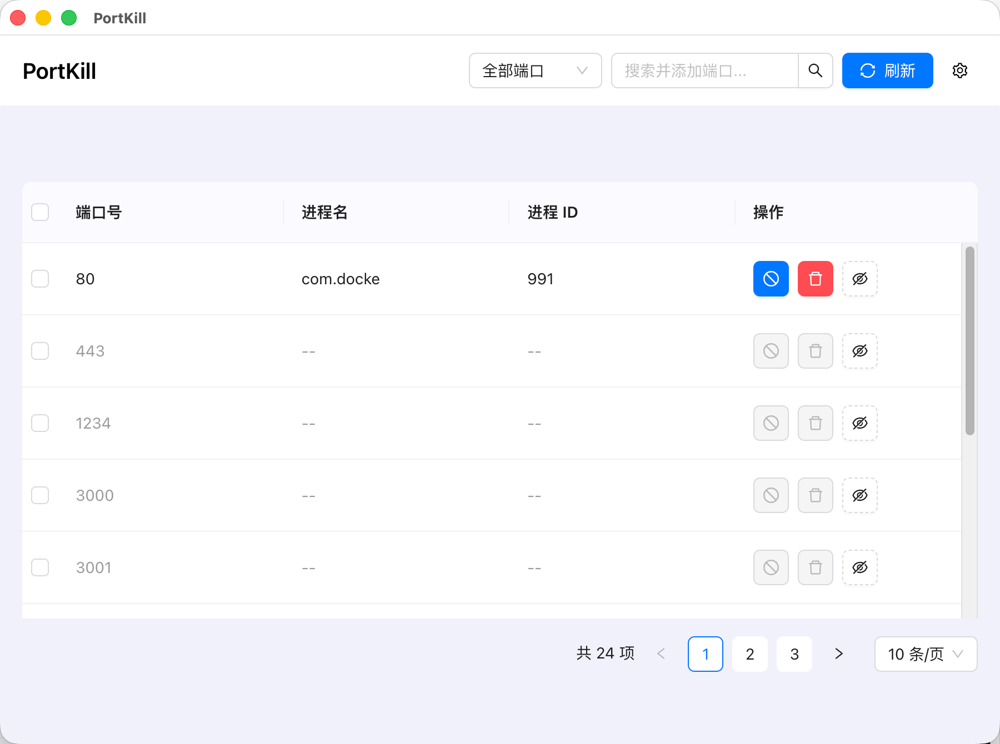
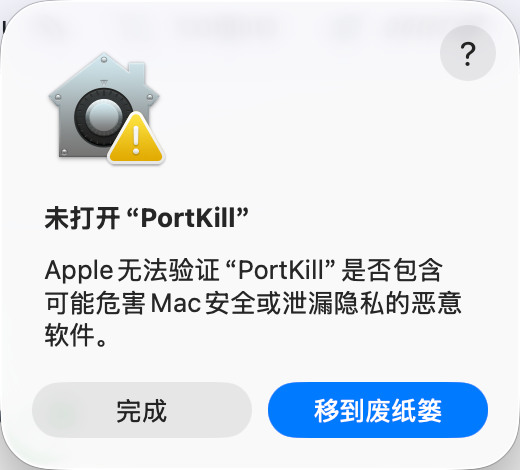
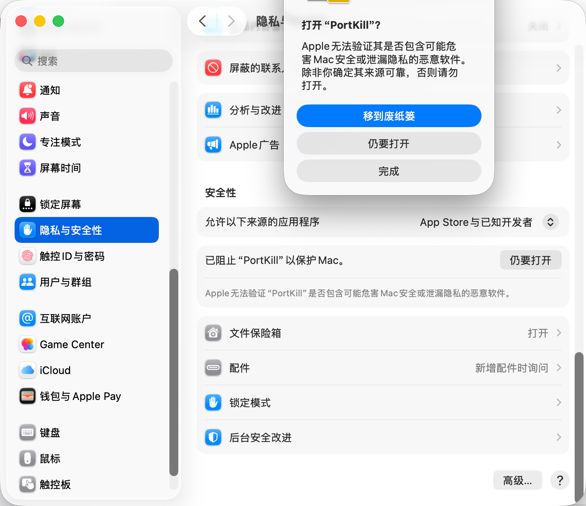

# PortKill

一款简洁的跨平台 TCP 端口管理工具。查看指定端口的监听进程，并可结束对应进程。

## 下载

前往 [GitHub Releases](https://github.com/bosens-China/PortKill/releases/) 下载适用于 macOS、Windows 或 Linux 的安装包。

> macOS 用户如果看到“Apple 无法验证”提示，请先确认安装包来自上述 Releases 页面，再按下方步骤打开应用。

## 界面预览



## 主要功能

- 监控 TCP 监听端口，支持 IPv4 和 IPv6。展示同一端口的全部可见进程及进程 ID。
- 支持结束单个或多个占用端口的进程。
- 未被占用的端口保留在列表中，方便持续观察。
- 支持自定义端口、深浅色主题和中英文界面。
- 关闭窗口后仍可通过系统托盘再次打开。

## 检测范围与操作说明

- 仅检测处于监听状态的 TCP 端口，不包含 UDP，也不列出普通 TCP 客户端连接。
- 结果受当前用户权限和系统进程可见性限制。未发现监听进程，不保证端口一定可供绑定。
- 扫描失败或超时时，端口显示“状态未知”并禁用查杀。未知不代表空闲。
- 同一端口可能由多个进程共同监听。结束端口上的进程时，会处理确认时列出的全部占用者。
- 结束的是整个进程，会影响它的其他端口和任务。程序会在执行前复核端口归属与进程启动信息；目标变化或无法核验时拒绝操作。
- 普通结束与强制结束都需要系统权限。强制结束不会提升权限；服务管理器自动重启进程后，端口可能再次被占用。
- Linux 需要安装 `lsof`。Windows 使用系统自带的 PowerShell 读取进程身份信息；无法读取时仍展示监听进程，但禁用查杀。

## macOS 无法打开应用

未加入 Apple Developer Program 的应用可能会被 macOS Gatekeeper 拦截，并显示 Apple 无法验证的提示。这表示 Apple 尚未验证该应用，并不代表应用一定安全。请仅对从 [GitHub Releases](https://github.com/bosens-China/PortKill/releases/) 下载的安装包执行以下操作。

1. 首次双击应用时，看到提示后点击“完成”。
2. 打开“系统设置 → 隐私与安全性”，滚动到页面底部，找到 PortKill 的拦截提示。
3. 点击“仍要打开”，并在随后出现的确认框中再次点击“仍要打开”。

<p align="center">
  
  
</p>

之后即可正常打开 PortKill。若未出现“仍要打开”按钮，请在 Finder 中按住 Control 键点按 PortKill，选择“打开”，再在确认框中点击“打开”。

## 本地开发

需要 Node.js 20+ 和 pnpm。Linux 还需安装 `lsof`（Debian/Ubuntu：`sudo apt install lsof`）。

```bash
git clone https://github.com/bosens-China/PortKill.git
cd PortKill
pnpm install
pnpm dev
```

## 开源协议

[MIT License](LICENSE) © 2026 yliu
